```{r options, include = FALSE}
knitr::opts_chunk$set(
  collapse = TRUE,
  comment = ""
)
```

# Introduction

`r Biocpkg("anndataR")` is designed to be an R native implementation of the `AnnData` object, inspired by the of the following packages:

* [_anndata_](https://anndata.readthedocs.io/en/stable/) ([scverse/anndata](https://github.com/scverse/anndata)): The Python `anndata` package and on-disk specification
* `r Biocpkg("zellkonverter")` ([theislab/zellkonverter](https://github.com/theislab/zellkonverter)): Convert `AnnData` files to/from `SingleCellExperiment` objects
* `r Githubpkg("mtmorgan/h5ad")`: Read/write `*.h5ad` files natively using `r Biocpkg("rhdf5")`
* `r CRANpkg("anndataR")` ([dynverse/anndata](https://github.com/dynverse/anndata)): An R implementation of the `AnnData` data structures, uses `r CRANpkg("reticulate")` to read/write `*.h5ad` files

Ideally, this package will be a complete replacement for all of these packages, and will be the go-to package for working with `AnnData` files in R.

# Core features

* An `r CRANpkg("R6")` `AnnData` class to work with objects in R
* In-memory (`InMemoryAnnData`), HDF5-backed (`HDF5AnnData`) and Python-backed (`ReticulateAnnData`) back ends with a consistent interface
* Read/write `.h5ad` files natively
* Convert to/from `SingleCellExperiment` objects
* Convert to/from `Seurat` objects

## Planned features

* Zarr-backed back end (`ZarrAnnData`)

## `AnnData` classes

The different `AnnData` classes provide a consistent interface but store and access data in different ways:

- The `InMemoryAnnData` stores data within the R session.
  This is the simplest back end and will be most familiar to users.
  It is want you will want to use in most cases where you want to interact with an `AnnData` object.
- The `HDF5AnnData` provides an interface to a H5AD file and minimal data is stored in memory until it is requested by the user.
  It is primarily designed as an intermediate object when reading/writing H5AD files but can be useful for accessing parts of large files.
- The `ReticulateAnnData` access data stored in an `AnnData` object in a concurrent Python session.
  This comes with the overhead and complexity of using `r CRANpkg("reticulate")` but is sometimes useful to access functionality that has not yet been implemented in `r Biocpkg("anndataR")`.
- The `ZarrAnnData` provides an interface to a Zarr data (i.e. Zarr store) and, similar to a H5AD file, minimal data is stored in memory until it is requested by the user. It is as an intermediate object when reading/writing Zarr store but can be useful for accessing parts of large files.
- An `AnnDataView` is returned when subsetting an `AnnData` object and provides access to a subset of the data in the referenced object.
  Some functionality (such as setting slots) requires converting to one of the full classes.

# Class diagram

This diagram shows the main `R6` classes provided by the package:



**Notation:**

  - `X: Matrix` - variable `X` is of type `Matrix`
  - `*X: Matrix` - variable `X` is abstract (and implemented by subclasses)
  - `as_SingleCellExperiment(): SingleCellExperiment` - function `as_SingleCellExperiment` returns object of type `SingleCellExperiment`
  - `*as_SingleCellExperiment()` - function `as_SingleCellExperiment` is abstract (and implemented by subclasses)
  - Dashed borders indicate classes that are planned but not yet implemented

# Session info

```{r sessioninfo}
sessionInfo()
```
