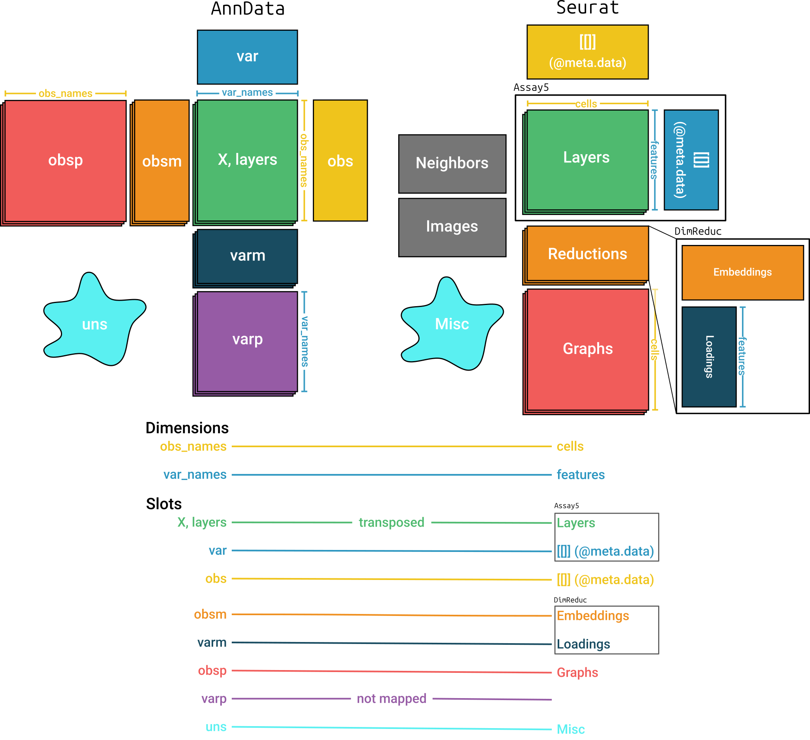

```{r options, include = FALSE}
knitr::opts_chunk$set(
  collapse = TRUE,
  comment = "#>",
  warning = FALSE
)
```

# Introduction

This vignette demonstrates how to read and write `SingleCellExperiment` objects using the `r Biocpkg("anndataR")` package, leveraging the interoperability between `SingleCellExperiment` and the `AnnData` format.

`SingleCellExperiment` is a widely used class for storing single-cell data in R, especially within the [Bioconductor](https://bioconductor.org/) ecosystem.
`r Biocpkg("anndataR")` enables conversion between `SingleCellExperiment` objects and `AnnData` objects, allowing you to leverage the strengths of both the [scverse](https://scverse.org/) and [Bioconductor](https://bioconductor.org/) ecosystems.

## Prerequisites

This vignette requires `r Biocpkg("SingleCellExperiment")` in addition to `r Biocpkg("anndataR")`.
You can install them using the following code:

```r
if (!requireNamespace("BiocManager", quietly = TRUE)) {
    install.packages("BiocManager")
}
BiocManager::install("SingleCellExperiment")
```

# Reading H5AD files and Zarr stores to a `SingleCellExperiment` object

Using an example `.h5ad` file included in the package, we will demonstrate how to read an `.h5ad` file and convert it to a `SingleCellExperiment` object.

```{r prep-h5ad-file}
library(anndataR)
library(SingleCellExperiment)

h5ad_file <- system.file("extdata", "example.h5ad", package = "anndataR")
```

Read the `.h5ad` file as a `SingleCellExperiment` object:

```{r read-data}
sce_obj <- read_h5ad(h5ad_file, as = "SingleCellExperiment")
sce_obj
```

This is equivalent to reading in the `.h5ad` file as an `AnnData` and explicitly converting:

```{r read-h5ad}
adata <- read_h5ad(h5ad_file)
sce <- adata$as_SingleCellExperiment()
sce
```

Similarly, we can read from a Zarr store which we also demonstrate with an example `.zarr` store: 

```{r prep-file, eval=FALSE}
zarr_path <- system.file("extdata", "example.zarr.zip", package = "anndataR")
td <- tempdir(check = TRUE)
unzip(zarr_path, exdir = td)
zarr_path <- file.path(td, "example.zarr")

sce_zarr <- read_zarr(zarr_path, as = "SingleCellExperiment")
sce_zarr
```

or 

```{r read-zarr, eval=FALSE}
adata <- read_zarr(zarr_path)
sce_zarr <- adata$as_SingleCellExperiment()
sce_zarr
```

# Mapping between `AnnData` and `SingleCellExperiment`

Figure \@ref(fig:mapping) shows the structures of the `AnnData` and `SingleCellExperiment` objects and how `r Biocpkg("anndataR")` maps between them.
It is important to note that matrices in the two objects are transposed relative to each other.

```{r mapping, fig.cap = "Mapping between `AnnData` and `SingleCellExperiment` objects", fig.wide = TRUE, echo = FALSE}

```

By default, all items in most slots are converted using the same names.
Items in the `varm` slot are only converted when they are specified in a mapping argument.
See `?as_SingleCellExperiment` for more details on the default mapping.

# Customizing the conversion

You can customize the conversion process by providing specific mappings for each slot in the `SingleCellExperiment` object.

Each of the mapping arguments can be provided with one of the following:

- `TRUE`: all items in the slot will be copied using the default mapping
- `FALSE`: the slot will not be copied
- A (named) character vector: the names are the names of the slot in the `SingleCellExperiment` object, the values are the names of the slot in the `AnnData` object.

See `?as_SingleCellExperiment` for more details on how to customize the conversion process. For instance:

```{r ex-mapping}
adata$as_SingleCellExperiment(
  x_mapping = "counts",
  assays_mapping = c("csc_counts"),
  colData_mapping = c("Int", "IntNA"),
  rowData_mapping = c(rowdata1 = "String", rowdata2 = "total_counts"),
  reducedDims_mapping = list(
    "pca" = c(sampleFactors = "X_pca", featureLoadings = "PCs"),
    "umap" = c(sampleFactors = "X_umap")
  ),
  colPairs_mapping = TRUE,
  rowPairs_mapping = FALSE,
  metadata_mapping = c(value1 = "Bool", value2 = "IntScalar")
)
```

The mapping arguments can also be passed directly to `read_h5ad()`.

# Writing a `SingleCellExperiment` object to a H5AD file or Zarr store

The reverse conversion is also possible, allowing you to convert a `SingleCellExperiment` object back to an `AnnData` object, or to just write out the `SingleCellExperiment` object as an `.h5ad` file or `.zarr` store.

```{r write-sce, eval=FALSE}
write_h5ad(sce_obj, tempfile(fileext = ".h5ad"))
write_zarr(sce_obj, tempfile(fileext = ".zarr"))
```

This is equivalent to converting the `SingleCellExperiment` object to an `AnnData` object and then writing it out:

```{r convert-and-write, eval=FALSE}
adata <- as_AnnData(sce_obj)
adata$write_h5ad(tempfile(fileext = ".h5ad"))
adata$write_zarr(tempfile(fileext = ".zarr"))
```

You can again customize the conversion process by providing specific mappings for each slot in the `AnnData` object. For more details, see `?as_AnnData`.

Here's an example:

```{r customize-anndata-conversion}
as_AnnData(
  sce_obj,
  x_mapping = "counts",
  layers_mapping = c("csc_counts"),
  obs_mapping = c(metadata1 = "Int", metadata2 = "IntNA"),
  var_mapping = FALSE,
  obsm_mapping = list(X_pca = "X_pca", X_umap = "X_umap"),
  obsp_mapping = TRUE,
  uns_mapping = c("Bool", "IntScalar")
)
```

The mapping arguments can also be passed directly to `write_h5ad()` or `write_zarr()`.

# Session info

```{r sessioninfo}
sessionInfo()
```
